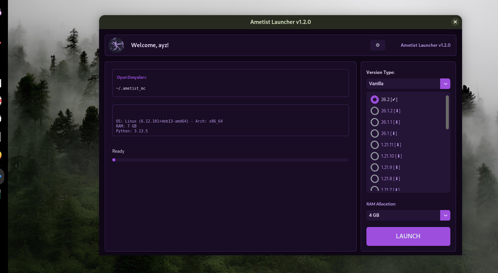
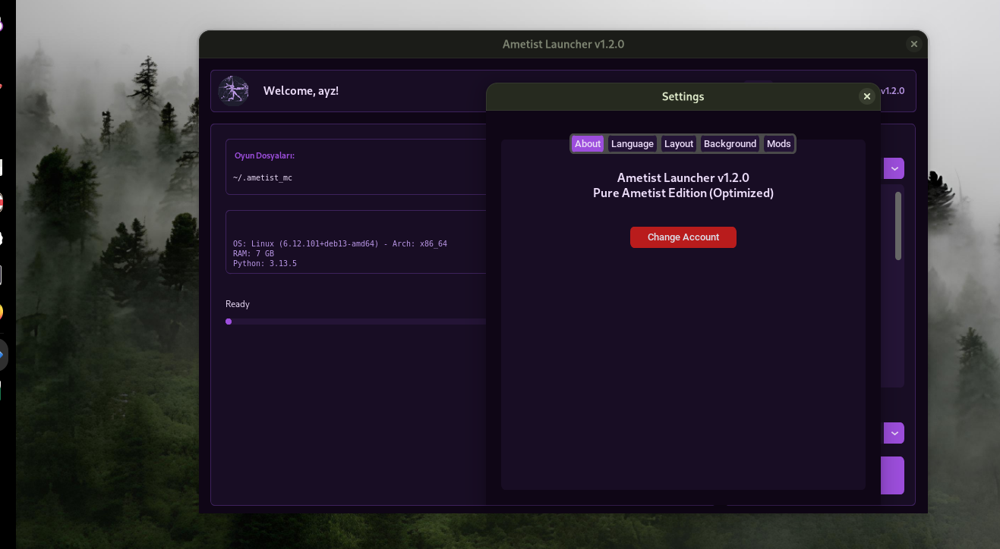

# Ametist Launcher

Ametist Launcher, Minecraft’ı sade ve rahat bir arayüz üzerinden başlatmak için geliştirilmiş, açık kaynaklı bir launcher’dır. Proje artık beta olarak değil, **tam sürüm** olarak sunulmaktadır.

Ametist; Vanilla, Fabric, Forge ve Quilt sürümlerini yönetebilir. İnternet bağlantısı olmadığında daha önce bilgisayara indirilmiş sürümleri algılar ve kullanılabilir sürümleri listeler.

## İndir

En güncel Windows ve Linux paketlerine [Releases sayfasından](https://github.com/ayzlol/ametist-launcher/releases/latest) ulaşabilirsin.

- **Windows:** `AmetistLauncher.exe`
- **Linux:** `AmetistLauncher-x86_64.AppImage`

Windows paketini indirip doğrudan çalıştırabilirsin. Linux’ta AppImage dosyasına çalıştırma izni vermen gerekir:

```bash
chmod +x AmetistLauncher-x86_64.AppImage
./AmetistLauncher-x86_64.AppImage
```

Minecraft’ın çalışması için sisteminde uyumlu bir Java Runtime Environment bulunmalıdır. İndirme dosyalarının SHA-256 değerleri release sayfasında gösterilir.

## Öne çıkan özellikler

Ametist, Vanilla ve mod yükleyicili oyun sürümleri için tek bir başlatma ekranı sunar. Desteklenen loader’lar Vanilla, Fabric, Forge ve Quilt’tir. İlk kurulum sırasında gerekli Minecraft ve loader dosyaları indirilir; daha sonraki açılışlarda yerel dosyalar kullanılır.

Launcher, bilgisayarın toplam RAM miktarını algılayabilir ve dinamik RAM sınırı önerebilir. İstersen RAM miktarını manuel olarak da seçebilirsin. Oyun başlatılırken G1 Garbage Collector ve ilgili JVM seçenekleri kullanılarak daha dengeli bir çalışma hedeflenir.

Arayüzde İngilizce, Türkçe, Rusça ve İspanyolca dilleri bulunur. Koyu tasarım, menü panelinin sol veya sağ tarafa alınması, özel arka plan, profil resmi ve ayarlar penceresi üzerinden hesap değiştirme desteklenir.

Ametist internet bağlantısını düzenli olarak kontrol eder. Bağlantı olmadığında yerel `versions` klasöründeki kurulu Vanilla, Fabric, Forge ve Quilt sürümlerini algılayarak yalnızca hazır olan sürümleri gösterir. Bu sayede daha önce indirilen oyun sürümlerini çevrim dışı kullanabilirsin.

Modlar sekmesi, Minecraft mod klasörünü açar. Mod dosyalarını `.minecraft` yerine Ametist’in kendi veri klasörü içindeki `mods` dizininden yönetebilirsin.

## Ekran görüntüleri

### Ana pencere



### Ayarlar



## Gereksinimler

Hazır Windows ve Linux paketlerinde Python ve proje kütüphaneleri paketlenmiştir. Minecraft için ayrıca uyumlu Java kurulumu gerekir.

Kaynak koddan çalıştırmak için:

- Python 3.8 veya üzeri
- pip
- Uyumlu Java Runtime Environment
- Git

## Kaynak koddan çalıştırma

```bash
git clone https://github.com/ayzlol/ametist-launcher.git
cd ametist-launcher
python -m venv venv
```

Windows:

```bat
venv\Scripts\activate
pip install -r requirements.txt
python Ametist.py
```

Linux veya macOS:

```bash
source venv/bin/activate
pip install -r requirements.txt
python3 Ametist.py
```

Windows’ta `run.bat`, Linux ve macOS’ta `run.sh` dosyasını da kullanabilirsin.

## İlk kullanım

1. Ametist’i çalıştır ve kullanıcı adını gir.
2. Vanilla, Fabric, Forge veya Quilt loader’larından birini seç.
3. Minecraft sürümünü seç.
4. RAM miktarını belirle.
5. Başlat düğmesine bas.

İlk kurulum sırasında internet bağlantısı gerekir. Oyun sürümü ve seçilen loader bilgisayara indirildikten sonra Ametist bunları yerel olarak algılar. İnternet bağlantısı olmadığında yalnızca daha önce kurulmuş sürümler listelenir.

## Ayarlar ve veri klasörü

Ametist ayarlarını ve oyun dosyalarını `.ametist_mc` klasöründe saklar:

```text
Windows: %APPDATA%\\.ametist_mc
Linux:   ~/.ametist_mc
macOS:   ~/.ametist_mc
```

Bu klasörde ayar dosyası, Minecraft sürümleri ve mod klasörü bulunur. Uygulamayı sıfırlamak istersen önce bu klasörün yedeğini alman önerilir.

## Sorun giderme

### Java bulunamadı

Uyumlu bir Java Runtime Environment kur ve `java` komutunun sistem PATH değişkeninde bulunduğundan emin ol. Ubuntu için örnek:

```bash
sudo apt install openjdk-17-jre-headless
```

### AppImage açılmıyor

Dosyaya çalıştırma izni ver:

```bash
chmod +x AmetistLauncher-x86_64.AppImage
```

### Sürüm listesi boş

İnternet bağlantını kontrol et. Çevrim dışı modda yalnızca daha önce kurulmuş sürümler gösterilir. Yeni bir Minecraft sürümünü ilk kez kurmak için internet bağlantısı gerekir.

### Oyun bellek hatası veriyor

Ayarlar bölümünden RAM miktarını sistemine göre değiştir. İşletim sisteminin ve diğer uygulamaların çalışması için yeterli RAM bırakmalısın.

## Hata bildirimi ve katkı

Bir hata ile karşılaşırsan [GitHub Issues](https://github.com/ayzlol/ametist-launcher/issues) üzerinden bildirebilirsin. Bildirimine işletim sistemini, Java sürümünü, Minecraft sürümünü, seçtiğin loader’ı ve görünen hata mesajını eklemen çözümü hızlandırır.

Fikirlerini ve kullanım deneyimini [GitHub Discussions](https://github.com/ayzlol/ametist-launcher/discussions) üzerinden paylaşabilirsin. Ametist bağımsız bir açık kaynak projesidir; katkılar ve yapıcı geri bildirimler memnuniyetle karşılanır.

## Sürüm bilgisi

Bu depo tam sürüm olan Ametist Launcher v1.2.1’i içerir. `main` dalı, yayınlanmış paketlerden daha yeni değişiklikler içerebilir. Kullanıma hazır Windows veya Linux paketini edinmek için [Latest Release](https://github.com/ayzlol/ametist-launcher/releases/latest) sayfasını kullan.

## Lisans

Ametist Launcher [MIT License](LICENSE) ile yayımlanır.

Ametist Launcher bağımsız bir açık kaynak projesidir; Mojang veya Microsoft tarafından desteklenmez ve bu şirketlerle bağlantılı değildir.

## Geliştiriciler

Ametist Launcher, [Unfayd](https://github.com/Unfayd) ve [Thepan](https://github.com/ayzlol) tarafından geliştirilmektedir.

Kullanılan temel teknolojiler Python, CustomTkinter, `minecraft-launcher-lib` ve Pillow’dur.
